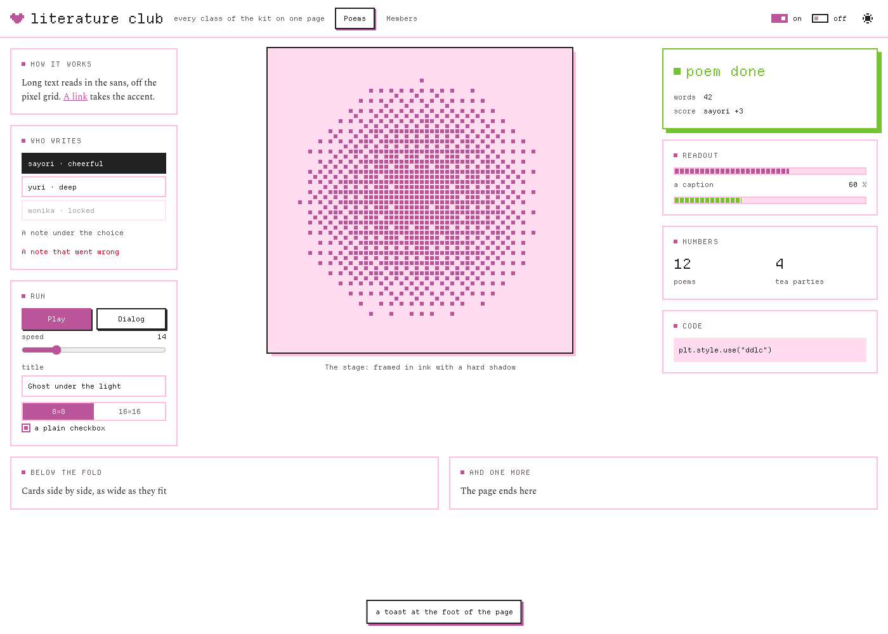
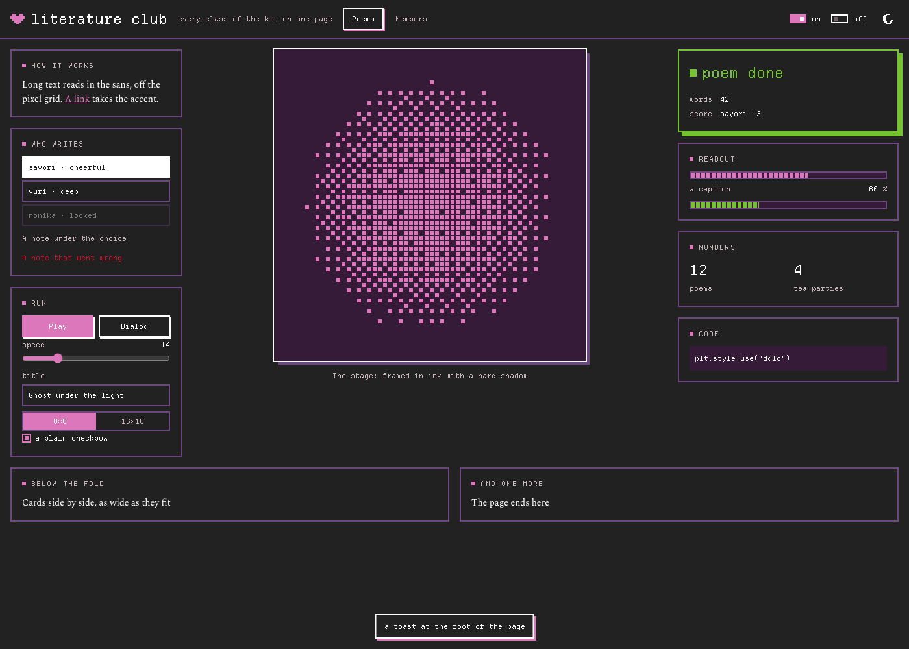
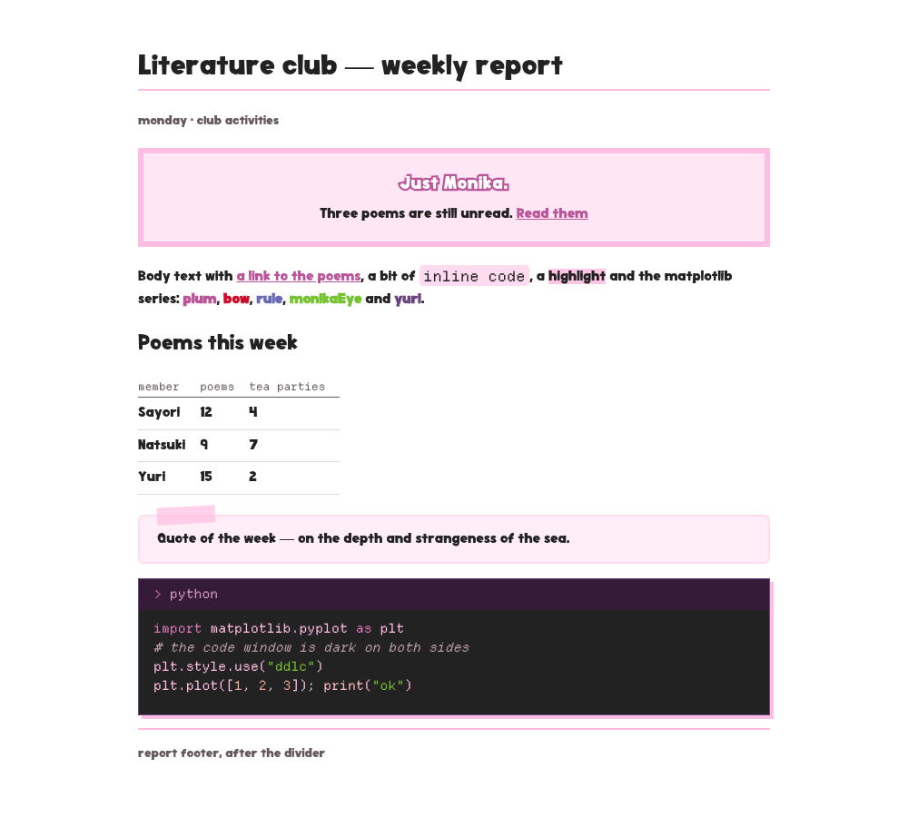
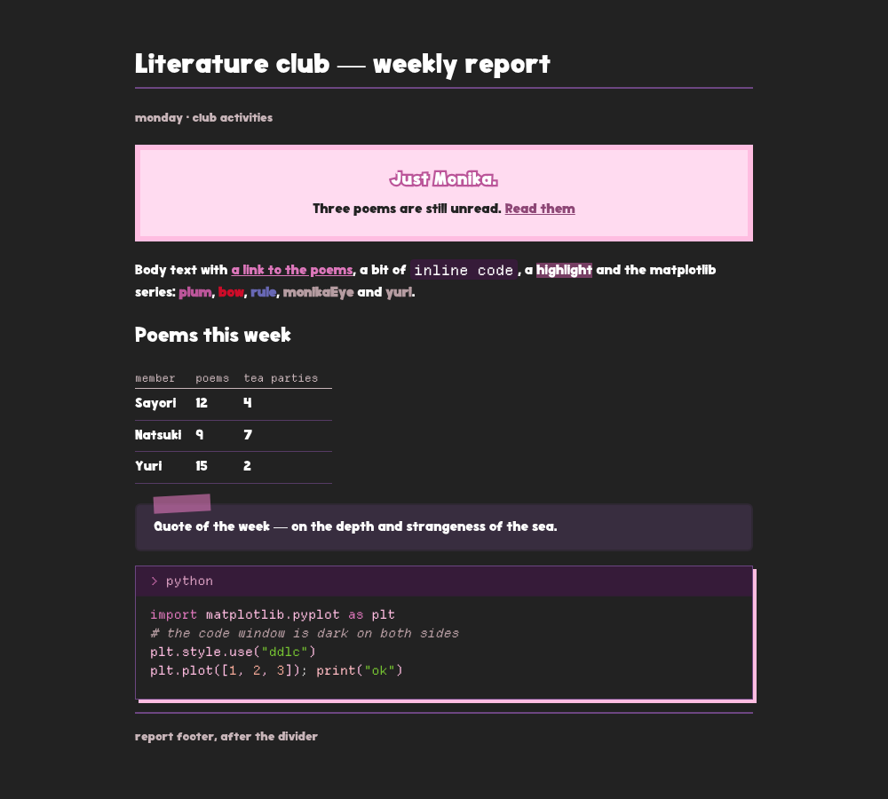

<div align="center">

# ddlc-themes

**The Doki Doki Literature Club colours for kitty, btop, matplotlib, Claude Code, opencode, your web pages, reports and letters, light and dark** （´ω｀♡%）


[](https://github.com/rokokol/ddlc-palette)
[](ASSETS.md)
[](LICENSE)
[](https://github.com/rokokol/ddlc-themes/actions/workflows/build.yml)
[](https://github.com/rokokol/ddlc-themes/actions/workflows/distro-debian.yml)
[](https://github.com/rokokol/ddlc-themes/actions/workflows/distro-ubuntu.yml)
[](https://github.com/rokokol/ddlc-themes/actions/workflows/distro-arch.yml)
[](https://github.com/rokokol/ddlc-themes/actions/workflows/distro-fedora.yml)

</div>

Themes for five applications, a web kit, a report stylesheet and the styles for HTML letters, rendered out of [ddlc-palette](https://github.com/rokokol/ddlc-palette). The palette measures every colour off [ddlc.moe](https://ddlc.moe) rather than eyeballing it. kitty and btop read the base16 schemes. The rest have more roles than sixteen slots, so their tables name palette colours directly. Nothing here is a taste call except which slot goes where

Everything that is not a terminal reads one table of roles and one table of syntax colours. So a muted caption, a link or a keyword is the same colour in a web page, a report, a letter, opencode, [ddlc.nvim](https://github.com/rokokol/ddlc.nvim) and the [Obsidian theme](https://github.com/rokokol/ddlc-obsidian-theme)

Came over from my rice, **[rokokol/huix](https://github.com/rokokol/huix)**

```sh
# render nothing, install nothing, just look
nix build github:rokokol/ddlc-themes && cat result/share/ddlc-themes/ddlc-kitty-dark.conf
```

## Contents

- [What it looks like](#what-it-looks-like)
- [In use](#in-use)
- [Install](#install)
  - [Home Manager](#home-manager)
  - [Any other distribution](#any-other-distribution)
- [Web pages, reports and letters](#web-pages-reports-and-letters)
- [Where the slots go](#where-the-slots-go)
- [Re-rendering](#re-rendering)
- [Tests](#tests)
- [Layout](#layout)

## What it looks like





> [`docs/ui-demo.html`](docs/ui-demo.html) is the page behind these, with every class of the kit. Serve the checkout over HTTP, because a browser does not load the kit's scripts from a file, and pin a variant with `?theme=dark`

|  |  |
| -------------------------------------------------------------- | ------------------------------------------------------------ |

> [`docs/report-demo.html`](docs/report-demo.html) is the page behind these. Open it from the checkout and pin a variant with `?theme=dark`

|  |  |
| ----------------------------------------------------------------------- | --------------------------------------------------------------------- |

> [`docs/matplotlib-demo.py`](docs/matplotlib-demo.py) renders both: the cycler on lines and bars — five series on paper, three on ink, which is the theme's own statement — and the two colormap families on the heatmaps


> The wallpaper comes through because kitty runs at `background_opacity 0.9` — neither theme sets an opacity of its own, and btop simply inherits the terminal's


## In use

- [bitmap.rokokol.art](https://bitmap.rokokol.art) ([source](https://github.com/rokokol/easy-bitmap)): an editor for 1-bit pictures on Arduino displays, drawn with the web kit
- [fly.rokokol.art](https://fly.rokokol.art) ([source](https://github.com/rokokol/fly-vs-cybersafe-lct2026)): an interactive page where a fly smells its way to a safe's PIN, drawn with the web kit
- [ddlc-obsidian-theme](https://github.com/rokokol/ddlc-obsidian-theme): an Obsidian theme on the same roles

## Install

### Home Manager

```nix
{
  inputs.ddlc-themes.url = "github:rokokol/ddlc-themes";

  # in your home configuration
  imports = [ inputs.ddlc-themes.homeManagerModules.default ];

  ddlc.kitty.enable = true;
  ddlc.btop.enable = true;
  ddlc.matplotlib.enable = true;
}
```

One switch per application, because each is wired up differently and the wiring is the half that goes wrong:

| option               | what it does                                                                                                           | default |
| -------------------- | ---------------------------------------------------------------------------------------------------------------------- | ------- |
| `kitty.enable`       | the colours into `kitty.conf`, after your own settings — kitty takes the last word for a key                           | `false` |
| `kitty.variant`      | `light` or `dark`                                                                                                      | `dark`  |
| `btop.enable`        | both themes into `~/.config/btop/themes/` and one of them named in `btop.conf`                                         | `false` |
| `btop.variant`       | which one is named. The other is deployed anyway — btop lists that directory, so it is a keypress away in its own menu | `dark`  |
| `matplotlib.enable`  | both styles into `~/.config/matplotlib/stylelib/` and the colormaps module next to them                                | `false` |
| `claude-code.enable` | both themes into `~/.claude/themes/`, where `/theme` lists them as `ddlc-dark` and `ddlc-light`                        | `false` |
| `opencode.enable`    | the one file into `~/.config/opencode/themes/` — it carries both variants itself                                       | `false` |

The last three have no `variant`: each application picks its own — matplotlib names a style per chart, Claude Code lists its themes directory in `/theme`, opencode reads the variant out of the file by the terminal's background. None of them touches the application's own config, so the selection stays yours; and a declaratively deployed theme is a read-only store link, so if you would rather keep the files editable in place, skip the switch and use `install.sh` below — it copies plain files

**Without the module.** `lib.kitty.{light,dark}`, `lib.btop.{light,dark}`, `lib.matplotlib.{light,dark,cmaps}`, `lib.claude-code.{light,dark}` and `lib.opencode` are paths, so `readFile` or a `source =` places them yourself; `packages.default` lays the same files under `share/ddlc-themes/`. The files for pages, reports and letters are paths too, see [below](#web-pages-reports-and-letters)

### Any other distribution

```sh
git clone https://github.com/rokokol/ddlc-themes
cd ddlc-themes
./install.sh              # --component kitty|btop|matplotlib|claude-code|opencode for one of them
```

Nothing is built: [`dist/`](dist) is committed, so this is a copy into `~/.config` — except the Claude Code themes, which land in `~/.claude/themes/` because that is where the application looks (`--claude-home` moves it). kitty gets both variants next to `kitty.conf`, where `include ddlc-kitty-dark.conf` resolves; matplotlib keeps its filenames, because they are the API — `plt.style.use("ddlc")`, `import ddlc_cmaps`. The rest list a theme under its file name, so the app segment is dropped on the way in: `ddlc-btop-dark.theme` lands as `ddlc-dark.theme`, the Claude Code pair as `ddlc-dark.json` and `ddlc-light.json`, and `ddlc-opencode.json` as `ddlc.json`

Nothing is ever installed behind your back: the script needs only coreutils, and if even that is missing it names what and how to get it, exactly, for your distribution. The applications being themed are not dependencies — a warning if one is absent, and the theme installs anyway

Every path written is recorded in `~/.config/ddlc-themes/install-manifest`, so the install is reversible, per component or whole:

```sh
./install.sh --uninstall --component btop   # take one application's themes out
./install.sh --uninstall                    # take everything out
```

Components are additive — installing one never touches another — but re-running one converges it: a file a previous install of that component wrote and this run does not is swept away

Tab completion for the installer's own flags is sourced from the checkout:

```sh
source completions/install.sh.bash   # bash
source completions/install.sh.zsh   # zsh
```

Package recipes can stage another config root without duplicating the layout: `DESTDIR="$pkgdir" ./install.sh --config-home /usr/share/ddlc-themes`. Add `--component kitty` or `--component btop` for split packages

## Web pages, reports and letters

These have no switch and no installer, because they belong next to a page and not in `~/.config`. Copy them out of `dist/`, take them from `lib` in the flake, or vendor them at a pinned commit:

| file | for | in the flake |
| --- | --- | --- |
| `ddlc-ui.css` | a web page or a small app: the bar, three columns of tools, stage and readouts, cards, buttons, switches, fields, meters, dialogs | `lib.ui` |
| `ddlc-theme.js`, `ddlc-cloud.js` | the theme button that cycles system, light and dark; the pointer's dithered cloud and the colour reader for a canvas | `lib.js.{theme,cloud}` |
| `DepartureMono-Regular.woff2` | the face the kit is drawn in, expected beside `ddlc-ui.css` | `lib.font` |
| `ddlc-report.css` | an HTML report: prose, tables, code as a kitty window, the "Just Monika." pop-up, quotes taped on | `lib.report` |
| `Nunito.woff2`, `Nunito-Italic.woff2` | the prose face of a report, expected beside `ddlc-report.css`; a heading takes Doki where it is installed and Nunito Black otherwise | `lib.nunito.{regular,italic}` |
| `ddlc-mail.json` | an HTML letter: the light colours, the faces and ready values for `style` attributes | `lib.mail` |
| `ddlc-tokens.css` | a theme that brings its own palette and selectors: the roles alone | `lib.tokens` |
| `ddlc-syntax.json` | an editor theme: the syntax colours per variant | `lib.syntax` |

Each stylesheet is one `<link>` and carries both variants: it follows the system until `data-theme="light|dark"` on `<html>` pins a side. A colour in a page's own rules comes from a `--ddlc-*` role, so it follows both sides too

A letter gets literal styles because Gmail drops any declaration that carries `var()`:

```python
mail = json.load(open(os.environ["DDLC_MAIL"]))
S = mail["styles"]
html = f'<div style="{S["page"]}"><h1 style="{S["h1"]}">Weekly report</h1></div>'
```

A new page starts from the template, which lays out the bar, the three columns and the cards and says how to vendor the kit into it:

```sh
nix flake init -t github:rokokol/ddlc-themes#app
```

## Where the slots go

kitty follows [tinted-kitty](https://github.com/tinted-theming/tinted-kitty) slot for slot with one departure: that template grounds the selection in `base03`, which leaves `base05` on it at 1.65:1 here, so `base02` carries it instead

btop has no base16 template anywhere upstream, so its mapping is this repository's own:

| group  | how it is coloured                                                                                                                                        |
| ------ | --------------------------------------------------------------------------------------------------------------------------------------------------------- |
| boxes  | `cpu_box` blue, `mem_box` green, `net_box` magenta, `proc_box` cyan — four accents, so a glance lands in the right panel                                  |
| load   | temperature, CPU and process gradients rise through the palette's warm accents: green, then yellow, then red                                              |
| meters | free, cached, available, used, download and upload carry no scale, so each is one colour with an empty mid and end, which is how btop spells a flat meter |

The roles are one table in `generate.sh`, and every stylesheet, the letters and the Obsidian theme read it. A role never takes the name of a palette colour, so a page can link `palette.css` beside a stylesheet from here. Links are plum with a pink hover and dividers are blush, because that is what the site itself does. Muted text mixes the jacket with the ink, because the bare jacket is too faint to read on paper. The series continue the matplotlib cycler: five on paper and three on ink, where `--ddlc-series-4` and `-5` collapse into the muted grey, so a tail that was not folded into the three stays visible but stops pretending to be a series

The syntax table holds ddlc.nvim's groups. Every colour in it reads at least 3:1 on its own ground, so a slot that does not is replaced in that variant, and `generate.sh` refuses a table that breaks the rule. opencode, ddlc.nvim and the code window of the report and the Obsidian theme all take their syntax colours from it

matplotlib's light cycler runs `plum, bow, rule, monikaEye, yuri`, and the order is the safety mechanism rather than a taste: adjacent entries are what a stacked bar or a multi-line chart puts side by side, and each neighbour pair clears deuteranopia and protanopia simulation by a measured OKLab distance. The dark cycler is three colours, not five — everything else either leaves the dark lightness band or falls under 3:1 on `ink`. `import ddlc_cmaps` adds four colormaps (and their `_r` reversals): sequential runs one hue toward the foreground of its ground, diverging is two one-hue arms about the only grey in it

Claude Code and opencode sit on the palette's named colours with the contrast checked per slot against the variant's own ground: the body text is `dot` on dark (12.6:1 on `ink`) and `yuriShadow` on light (15.3:1) rather than a saturated pink — the pinks are accents there, not the page — and the rest spreads across the palette: `sayoriEye` for permissions, `monikaEye` and `ribbon` for success, the blues for links, `bow` for errors, and the syntax table for code. The light variants leave the added-diff background to the base theme (Claude Code) or the terminal (opencode), because the site ships no light green

> [!NOTE]
> The two variants draw different accents, because the palette is polarised — a colour that reads on `ink` is a pastel on `paper`. For kitty and btop the [slot table](https://github.com/rokokol/ddlc-palette#as-a-theme) in ddlc-palette says which palette key fills which base16 slot; for the other three the tables sit in `generate.sh` itself

## Re-rendering

`generate.sh` reads the two base16 yamls and the flat `palette.env`, and writes `dist/`. It also assembles the stylesheets and scripts out of `src/` and copies the vendored font. The devShell puts all three inputs in the environment:

```sh
nix develop -c ./generate.sh
./generate.sh --light base16-ddlc-light.yaml --dark base16-ddlc-dark.yaml \
  --palette palette.env   # without Nix
```

The colours come from ddlc-palette and nothing else does — the palette is measured, this repository is only a mapping. A weekly workflow re-renders against the palette's HEAD rather than the lock and opens a pull request when they part ways, so a colour cannot move upstream and quietly leave this dark

## Tests

`nix flake check` proves that `dist/` is what `generate.sh` writes today, that every value in it is a hex colour the palette actually holds (down to every opencode reference resolving against its `defs`, and every letter style holding no `var()`), that the module wires every application up (and touches none while disabled), that every shell file passes shellcheck and shfmt with the completions in step with `install.sh`, and it runs `tests/run.sh` — the installer's whole contract: manifest, per-component sweep, selective uninstall, staging, the refusal path

`tests/distro.sh <distro>` (needs docker or podman) runs the full cycle inside a real `debian`, `ubuntu`, `arch` or `fedora` container: preflight, its printed guidance run verbatim, install, selective uninstall, uninstall. In CI that is the four distro badges — on push, weekly against `:latest`, never on pull requests

## Layout

```
generate.sh   the mapping: base16 slots and palette colours in, the themes out
src/          the web kit, the report stylesheet and the scripts, by hand
vendor/       Departure Mono and Nunito, kept byte-equal to their sources by vendor-sync.sh
templates/    the page `nix flake init -t` starts from
nix/          module.nix, module-test.nix
dist/         the rendered themes, committed for consumers without Nix
install.sh    for systems without Nix; VERSION is the one source of version
completions/  tab completion for install.sh, sourced from the checkout
check-sh.sh   vendored from bash-best-practices, holds install.sh's help
              and completions to its parser
tests/        run.sh (fast, sandboxed), distro.sh (containers)
```
